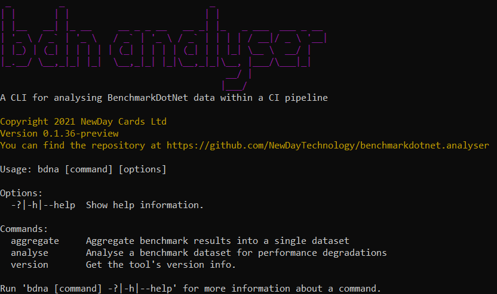

 
 [](code_of_conduct.md)

# BenchmarkDotNet Analyser



A .NET CLI tool for analysing [BenchmarkDotNet](https://benchmarkdotnet.org/) results.

BDNA aggregates and analyses [BenchmarkDotNet](https://benchmarkdotnet.org/) results for performance degredations. If you want to ensure your critical code has acceptable performance in your CI pipelines BDNA may help you.

---


# Getting started


## Installation

To install BDNA, you'll need the [.NET 5 SDK or runtime](https://dotnet.microsoft.com/download/dotnet/5.0). BDNA can be downloaded and installed from [Github Packages](https://github.com/orgs/NewDayTechnology/packages). 


---


## Building locally

To build, you'll need the [.NET 5 SDK](https://dotnet.microsoft.com/download/dotnet/5.0).
The local build scripts are a [FAKE build script](FakeBuild.fsx) and a [Powershell bootstrapper](build.ps1). 

By default, the build script will restore, build, run tests and package:

```powershell
.\build.ps1
```

If you need to build up to a [certain target](FakeBuild.fsx) just give the target's name:

```powershell
.\build.ps1 "Unit Tests"
```


---


# Usage


## What BDNA needs from BenchmarkDotNet

BDNA analyses the full JSON report files from [BenchmarkDotNet](https://benchmarkdotnet.org/). These files have the suffix ``-report-full.json`` and are generated by benchmarks with the ``JsonExporterAttribute.Full`` attribute; they are usually found under ``./BenchmarkDotNet.Artifacts/results`` folders. See [Exporters](https://benchmarkdotnet.org/articles/configs/exporters.html) for more information.

BDNA also requires benchmarks with full statistics, generated by the ``[MinColumn, MaxColumn, Q1Column, Q3Column, AllStatisticsColumn]`` benchmark attributes: see [Statistics](https://benchmarkdotnet.org/articles/features/statistics.html) in the documentation.

---


### Example


```csharp
[MinColumn, MaxColumn, Q1Column, Q3Column, AllStatisticsColumn]
[JsonExporterAttribute.Full]    
public class Md5VsSha256Benchmark
{
    private readonly SHA256 _sha256 = SHA256.Create();
    private readonly MD5 _md5 = MD5.Create();
    private byte[] _data;

    [Params(1000, 10000, 100000)]
    public int N;

    [GlobalSetup]
    public void Setup()
    {
        _data = new byte[N];
        new Random(42).NextBytes(_data);
    }

    [Benchmark]
    public byte[] Sha256() => _sha256.ComputeHash(_data);

    [Benchmark]
    public byte[] Md5() => _md5.ComputeHash(_data);
}
```


---


## How BDNA collects data

BDNA collects [BenchmarkDotNet](https://benchmarkdotnet.org/) full JSON report files, as described above. BDNA will aggregate these results into a single dataset for follow-up analysis. 

To aggregate use ``bdna aggregate`` giving the folder containing new results (``--new``), the folder containing a previous aggregated dataset (``--aggregates``), and the folder for the new dataset (``--output``). 

---


### Example


Aggregate results from `./BenchmarkDotNet.Artifacts/results` into the dataset at `./aggregates` and fold into the same dataset. A maximum of 100 benchmark runs will be retained. The new results are tagged with build version `$BUILD_NUMBER`:

```powershell
dotnet bdna aggregate --new "./BenchmarkDotNet.Artifacts/results" --aggregates "./aggregates" --output "./aggregates" --runs 100 --build $BUILD_NUMBER
```


---


```
Aggregate benchmark results into a single dataset.

Usage: bdna aggregate [options]

Options:
  -new|--new <NEW_BENCHMARKS_PATH>                 The path containing new benchmarks results.
  -aggs|--aggregates <AGGREGATED_BENCHMARKS_PATH>  The path containing the dataset to roll into.
  -out|--output <OUTPUT_AGGREGATES_PATH>           The path for the new dataset.
  -runs|--runs <BENCHMARK_RUNS>                    The number of benchmark runs to keep when aggregating.
  -build|--build <BUILD_NUMBER>                    The new build's number/version. Optional.
  -builduri|--builduri <BUILD_URI>                 The new build's URL. Optional.
  -branch|--branch <BRANCH_NAME>                   The new build's branch name. Optional.
  -t|--tag <TAGS>                                  A tag for the new build. Optional, multiple tags can be given.
  -v|--verbose                                     Emit verbose logging.
  -?|-h|--help                                     Show help information.
```

``--new``: the folder containing a new benchmark run to fold into the aggregate dataset. This is typically the ``./**/BenchmarkDotNet.Artifacts/results`` folder.

``--aggregates``: the folder containing previously aggregated data. 

``--output``: the folder for the new dataset. The aggregates from ``--aggregates`` and the new results from ``--new`` will be placed into the ``--output`` path. Both the ``--aggregates`` and ``--output`` arguments can be the same.

``--runs``: the maximum number of benchmark results that are aggregated in ``--output``. 

``--build``: the new build's version number.

``--builduri``: the new build's URL.

``--branch``: the new build's branch name.

``--tag``: arbitrary tags to assign to the new benchmark run. Multiple tags can be assigned to the run.

---

## How BDNA analyses benchmarks

Use ``bdna analyse`` to scan the aggregate dataset for degradations.

Every benchmark run (that is, the benchmark type, method and parameters) is analysed in isolation. For example, if your benchmarks have runs ``Dijkstra(Depth=1)`` & ``Dijkstra(Depth=2)`` each of these will be analysed independently, and not ``Dijkstra()`` as a whole.

From all the aggregated runs, BDNA picks the minimum mean time value per run as the baseline value, or whatever statistic you elect to analyse. The benchmark run that was added last is taken as the comparand: if this latest value is within your tolerances the analysis will pass, if not the analysis fails. 

Successful checks will give a return code of 0, failures will return 1.

---

### Example

Analyse the aggregates at `./aggregates`, with a 10% tolerance, maximum of 5 errors, for those benchmarks containing `simple` or `complex` in their names, with verbose output:

```powershell
dotnet bdna analyse --aggregates "./aggregates" --tolerance 10 --maxerrors 5 --filter *simple* --filter *complex* --verbose
```

---

```
Analyse a benchmark dataset for performance degradation.

Usage: bdna analyse [options]

Options:
  -tol|--tolerance <TOLERANCE>          Tolerance of errors from baseline performance.
  -max|--maxerrors <MAX_ERRORS>         The maximum number of failures to tolerate.
  -stat|--statistic <STATISTIC>         The result statistic to analyse.
  -f|--filter <FILTERS>                 Filter by class or namespace. Optional, multiple filters can be given.
  -aggs|--aggregates <AGGREGATES_PATH>  The path of the aggregated dataset to analyse.
  -v|--verbose                          Emit verbose logging.
  -?|-h|--help                          Show help information.
```

``--aggregates``: the folder containing the aggregated dataset. This is the same as the ``--output`` parameter from ``bdna aggregate``.

``--tolerance``: the percentage deviance from the minimum value. 

``--maxerrors``: the maximum number of errors for the analysis to pass. If this is 0 then any error will cause the analysis to fail.

``--statistic``: the statistic value, for each run, to use. By default this is ``MeanTime`` with ``MinTime``, ``MaxTime``,  ``MedianTime``, ``Q1Time`` & ``Q3Time``.

``--filter``:    Filter for specific namespaces, types or methods. Simple wildcards are supported, e.g. ``-f * -f *Benchmark -f Benchmark*``. Multiple filters can be specified and will be applied conjunctively. 

If there are no degradations in performance, ``bdna analyse`` will give a return code of 0, otherwise 1 will be returned. This is what your CI pipeline must watch to fail builds.

---

## Reporting 

You can report on the aggregated benchmark dataset. Each benchmark run is exported, together with any build number, build URL, branch & tags that were taken at the time of aggregation, giving a time series of benchmarks per build.

---

### Example

Generate CSV and JSON reports for the aggregates at  `./aggregates`, sending output to `./reports`:

```powershell
dotnet bdna report --aggregates "./aggregates" --reporter csv --reporter json --output "./reports"
```

---

```
Build reports from a benchmark dataset.

Usage: bdna report [options]

Options:
  -aggs|--aggregates <AGGREGATES_PATH>  The path of the aggregated dataset to analyse.
  -r|--reporter <REPORTERS>             The reporting style. Optional, multiple reporters can be given.
  -out|--output <OUTPUT_PATH>           The path for reports.
  -f|--filter <FILTERS>                 Filter by class or namespace. Optional, multiple filters can be given.
  -v|--verbose                          Emit verbose logging.
  -?|-h|--help                          Show help information.
```

``--aggregates``: the folder containing the aggregated dataset. This is the same as the ``--output`` parameter from ``bdna aggregate``.

``--output``: the destination folder for reports.

``--reporter``: the reporter style to use. Multiple may be provided from ``Csv`` (the default) and ``Json``.

``--filter``:    Filter for specific namespaces, types or methods. Simple wildcards are supported, e.g. ``-f * -f *Benchmark -f Benchmark*``. Multiple filters can be specified and will be applied conjunctively. 

---


# Contributing
[How to Contribute](CONTRIBUTING.md)


# Report a security vulnerability
[Security notes](SECURITY.md)


# Support
[How we support this project](SUPPORT.md)


---


## Technologies used
We use C# and .NET 5.0 for this project. Some 3rd party packages that we depend on:-
* [Newtonsoft.Json](https://www.nuget.org/packages/Newtonsoft.Json/)
* [Nate McMaster's Command line utils](https://www.nuget.org/packages/McMaster.Extensions.CommandLineUtils)
* [Microsoft's Dependency Injection](https://www.nuget.org/packages/Microsoft.Extensions.DependencyInjection)
* [Crayon](https://www.nuget.org/packages/Crayon/)
* [FluentAssertions](https://www.nuget.org/packages/FluentAssertions)
* [CsvHelper](https://www.nuget.org/packages/CsvHelper/)
* [FsCheck](https://www.nuget.org/packages/FsCheck.Xunit)
* [NSubstitute](https://www.nuget.org/packages/NSubstitute/)
* [Coverlet](https://www.nuget.org/packages/coverlet.collector/)
* [Xunit](https://www.nuget.org/packages/xunit/)
* [Stryker](https://stryker-mutator.io/docs/stryker-net/Introduction/)
* [FAKE](https://fake.build/)
* [CRC32](https://www.nuget.org/packages/Crc32.NET/)
* [ReportGenerator](https://www.nuget.org/packages/dotnet-reportgenerator-globaltool/)
---

## Further reading

[License](LICENSE)

[Copyright notice](NOTICE)

[Our Code of Conduct](CODE_OF_CONDUCT.md)

---

# License
Distributed under the Apache 2.0 license. See [`LICENSE`](LICENSE) for more information.